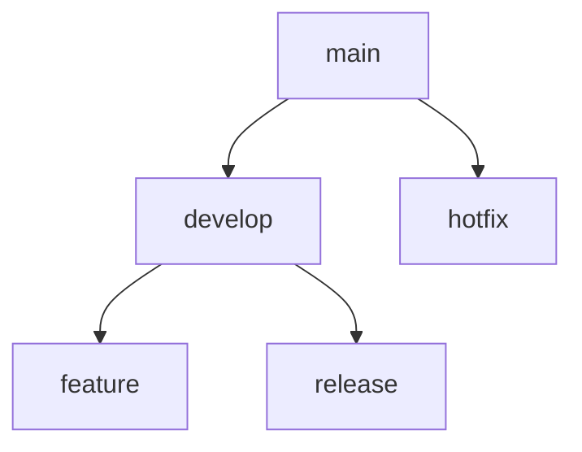

# 잡던 프로젝트 (JobDone)

<div align="center">
  

</div>

## 📚 목차

- [프로젝트 소개](#프로젝트-소개)
- [기술 스택](#기술-스택)
- [개발 규칙](#개발-규칙)
- [폴더 구조](#폴더-구조)

## 🚀 프로젝트 소개

잡던(JobDone)은 다양한 전문 서비스를 중개하는 온라인 플랫폼입니다.

### 주요 기능

- 전문가/업체 검색 및 예약
- 견적서 요청 및 관리
- 실시간 결제 시스템
- 전문가를 위한 비즈니스 관리 도구
  - 예약/일정 관리
  - 견적서 관리
  - 고객 문의 및 리뷰 관리
  - 매출 통계

### 특징

- React와 JavaScript 기반의 모던한 프론트엔드 아키텍처
- Recoil을 활용한 효율적인 상태 관리
- 전문가와 일반 사용자를 위한 이원화된 인터페이스
- 카카오페이 결제 연동
- JWT 기반 인증 시스템

## 🛠 기술 스택

### Frontend

[]()
[]()
[]()
[]()
[]()
[]()
[]()
[]()

### Development Tools

[]()
[]()
[]()

## 📋 개발 규칙

### 1. 코딩 컨벤션

| 구분                             | 규칙         | 예시                           |
| -------------------------------- | ------------ | ------------------------------ |
| 변수, 상수, 함수, 파일, 클래스명 | camelCase    | `userName`, `getData()`        |
| JSX/TSX 파일명                   | PascalCase   | `UserProfile.tsx`              |
| 화살표 함수                      | context 사용 | `const handleClick = () => {}` |

### 2. 커밋 컨벤션

| 태그       | 설명                                |
| ---------- | ----------------------------------- |
| `feat`     | 새로운 기능 구현 및 추가            |
| `fix`      | 오류 수정                           |
| `docs`     | 문서 관련 변경 (README.md, JSON 등) |
| `style`    | 코드 포맷팅, 세미콜론 누락 등       |
| `refactor` | 코드 리팩토링                       |
| `chore`    | 빌드 관련 변경, 패키지 매니저 수정  |
| `rename`   | 파일/폴더명 변경                    |
| `remove`   | 파일 삭제                           |

### 3. 브랜치 전략



- `main`: 메인 서버 배포용
- `develop`: 개발 단계 통합 브랜치
- `feature`: 기능 개발용
- `release`: 테스트용
- `hotfix`: 긴급 버그 수정용

## 폴더구조

```
<<<<<<< HEAD
job_done
=======
job-done
>>>>>>> 969ff1ba4210ffa8d7efb12ae2ef68e1cf92838a
├─ .prettierrc
├─ eslint.config.js
├─ index.html
├─ package-lock.json
├─ package.json
├─ public
<<<<<<< HEAD
│  ├─ images
│  │  ├─ arrow-right.svg
│  │  ├─ b-logo.svg
│  │  ├─ event
│  │  │  ├─ event_banner_1.png
│  │  │  ├─ event_banner_2.jpg
│  │  │  └─ event_banner_3.jpg
│  │  ├─ logo.svg
│  │  └─ order
│  │     ├─ cleaning_icon.jpg
│  │     ├─ default_profile.jpg
│  │     ├─ Group 80.png
│  │     └─ Interior_1.jpg
│  ├─ kakao_login_large_wide.png
│  └─ vite.svg
├─ README.md
├─ server
│  └─ server.json
=======
│  └─ images
├─ README.md
>>>>>>> 969ff1ba4210ffa8d7efb12ae2ef68e1cf92838a
├─ src
│  ├─ apis
│  │  ├─ cookie.js
│  │  └─ login.js
│  ├─ App.css
│  ├─ App.jsx
│  ├─ assets
│  │  └─ react.svg
│  ├─ atoms
│  │  ├─ businessAtom.js
│  │  ├─ categoryAtom.js
│  │  ├─ like.js
│  │  ├─ loginAtom.js
│  │  ├─ portfolioAtom.js
│  │  ├─ reservationAtom.js
│  │  ├─ reviewAtom.js
│  │  └─ statusAtom.js
│  ├─ components
│  │  ├─ expert-header
│  │  │  ├─ ExpertHeader.jsx
│  │  │  └─ header.js
│  │  ├─ expert-info
│  │  │  ├─ ExpertInfo.jsx
│  │  │  ├─ ExpertInfoEdit.jsx
│  │  │  ├─ Logo.jsx
│  │  │  └─ LogoEdit.jsx
│  │  ├─ expert-List
│  │  │  ├─ expertList.js
│  │  │  └─ ExportFilter.jsx
│  │  ├─ expert-side-menu
│  │  │  ├─ ExpertSideMenu.jsx
│  │  │  └─ sideMenu.js
│  │  ├─ ExpertLayout.jsx
│  │  ├─ Footer.jsx
│  │  ├─ Header.jsx
<<<<<<< HEAD
=======
│  │  ├─ JobBLogo.jsx
>>>>>>> 969ff1ba4210ffa8d7efb12ae2ef68e1cf92838a
│  │  ├─ Layout.jsx
│  │  ├─ LoadingPopup.jsx
│  │  ├─ MyPageLayout.jsx
│  │  ├─ papers
│  │  │  ├─ Estimate.jsx
│  │  │  ├─ ExpertReservation.jsx
│  │  │  ├─ papers.js
│  │  │  └─ UserReservation.jsx
│  │  ├─ pay.js
│  │  ├─ PaymentFailed.jsx
│  │  ├─ PaymentSuccess copy.jsx
│  │  ├─ PaymentSuccess.jsx
│  │  ├─ portfolio
│  │  │  ├─ AddPortfolio.jsx
│  │  │  ├─ EditPortfolio.jsx
│  │  │  └─ portfolio.js
│  │  ├─ ProfileImage.jsx
│  │  ├─ service
│  │  │  ├─ Filter.jsx
│  │  │  ├─ service.js
│  │  │  ├─ ServiceListItem.jsx
│  │  │  └─ ServiceListTop.jsx
│  │  ├─ serviceDetail
│  │  │  ├─ ContPortfolioList.jsx
│  │  │  ├─ ContReview.jsx
│  │  │  ├─ DetailContents.jsx
│  │  │  ├─ DetailTop.jsx
│  │  │  ├─ PfPopup.jsx
│  │  │  └─ serviceDetail.js
│  │  ├─ ServiceIcon.jsx
│  │  ├─ ServiceSkeleton.jsx
│  │  ├─ ui
│  │  │  ├─ Button.jsx
│  │  │  ├─ Popup.jsx
│  │  │  └─ ui.js
│  │  └─ UserLayout.jsx
│  ├─ context
│  │  └─ Context.jsx
│  ├─ index.css
<<<<<<< HEAD
=======
│  ├─ main
>>>>>>> 969ff1ba4210ffa8d7efb12ae2ef68e1cf92838a
│  ├─ main.jsx
│  ├─ main.tsx
│  ├─ pages
│  │  ├─ auth
│  │  │  ├─ business
│  │  │  │  ├─ businessnumber.css
│  │  │  │  ├─ BusinessNumber.jsx
│  │  │  │  └─ Index.jsx
│  │  │  └─ login
│  │  │     ├─ emailpage.css
│  │  │     ├─ EmailPage.jsx
│  │  │     ├─ Index.css
│  │  │     ├─ Index.jsx
│  │  │     ├─ memo
│  │  │     ├─ memo.jsx
│  │  │     ├─ passwordedit.css
│  │  │     ├─ PasswordEdit.jsx
│  │  │     ├─ passwordemail.css
│  │  │     ├─ PasswordEmail.jsx
│  │  │     ├─ passwordemailcheck.css
│  │  │     ├─ PasswordEmailCheck.jsx
│  │  │     ├─ signupdone.css
│  │  │     ├─ SignUpDone.jsx
│  │  │     ├─ signuppage.css
│  │  │     └─ SignUpPage.jsx
│  │  ├─ company
│  │  │  ├─ Index.jsx
│  │  │  └─ ReservationPage.jsx
│  │  ├─ expert
│  │  │  ├─ company-management
│  │  │  │  ├─ CompanyInfo.jsx
│  │  │  │  ├─ companyManagement.js
│  │  │  │  ├─ EditCompanyInfo.jsx
│  │  │  │  ├─ EditDetailPage.jsx
│  │  │  │  ├─ ExpertDetailPage.jsx
│  │  │  │  └─ Portfolio.jsx
│  │  │  ├─ expertmain.css
│  │  │  ├─ ExpertMain.jsx
│  │  │  ├─ expertmainreservelist.js
│  │  │  ├─ ExpertMainReserveList.jsx
│  │  │  ├─ management
│  │  │  │  ├─ CompanyInfo.jsx
│  │  │  │  ├─ EditCompanyInfo.jsx
│  │  │  │  ├─ EditDetailPage.jsx
│  │  │  │  ├─ ExpertDetailPage.jsx
│  │  │  │  └─ Portfolio.jsx
│  │  │  ├─ message-center
│  │  │  │  └─ Index.jsx
│  │  │  ├─ payment-management
│  │  │  │  └─ Index.jsx
│  │  │  ├─ quotation
│  │  │  │  ├─ CreateQuotation.jsx
│  │  │  │  ├─ EditQuotation.jsx
│  │  │  │  └─ QuotationService.jsx
│  │  │  ├─ quote-management
│  │  │  │  ├─ EditQuotation.jsx
│  │  │  │  ├─ Index.jsx
│  │  │  │  ├─ qouteManagement.js
│  │  │  │  └─ QuotationForm.jsx
│  │  │  ├─ reservation-management
│  │  │  │  ├─ Index.jsx
│  │  │  │  └─ reservationMangement.js
│  │  │  ├─ review-center
│  │  │  │  ├─ index.css
│  │  │  │  ├─ Index.jsx
│  │  │  │  ├─ reviewview.css
│  │  │  │  └─ ReviewView.jsx
│  │  │  ├─ schedule-management
│  │  │  │  ├─ index.css
│  │  │  │  └─ Index.jsx
│  │  │  └─ statistics
│  │  │     └─ Index.jsx
│  │  ├─ Index.jsx
│  │  ├─ mypage
│  │  │  ├─ Index.jsx
│  │  │  ├─ MyMessage.jsx
│  │  │  ├─ MyReservation.jsx
│  │  │  ├─ ReviewPage.jsx
│  │  │  ├─ UsageDetails.jsx
│  │  │  ├─ UserReservLook.jsx
│  │  │  └─ Wishlist.jsx
│  │  ├─ NotFound.jsx
│  │  ├─ page.js
│  │  ├─ Qna.jsx
│  │  ├─ reservation
│  │  │  ├─ Index.jsx
│  │  │  ├─ reservation.js
│  │  │  └─ ReservationHistory.jsx
│  │  └─ servicepage
│  │     ├─ ContactUs.jsx
│  │     ├─ Detail.jsx
│  │     ├─ Index.jsx
│  │     └─ servicepage.js
│  ├─ routers
│  │  └─ Root.jsx
<<<<<<< HEAD
=======
│  ├─ styles
│  │  ├─ login
│  │  └─ order
>>>>>>> 969ff1ba4210ffa8d7efb12ae2ef68e1cf92838a
│  ├─ types
│  │  └─ TypeBox.ts
│  ├─ utils
│  │  └─ Cookie.jsx
│  └─ vite-env.d.ts
├─ tailwind.config.js
├─ tsconfig.app.json
├─ tsconfig.json
├─ tsconfig.node.json
└─ vite.config.ts
<<<<<<< HEAD

```
=======
```
>>>>>>> 969ff1ba4210ffa8d7efb12ae2ef68e1cf92838a
